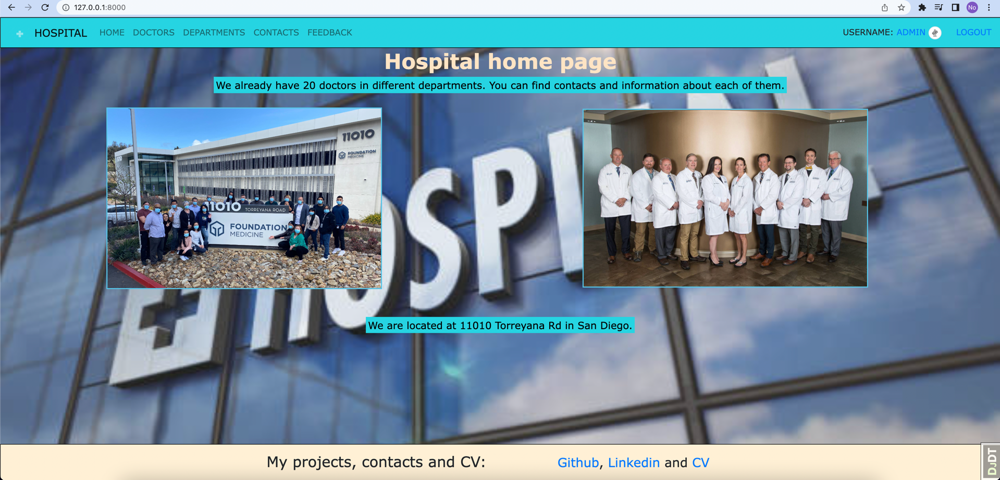
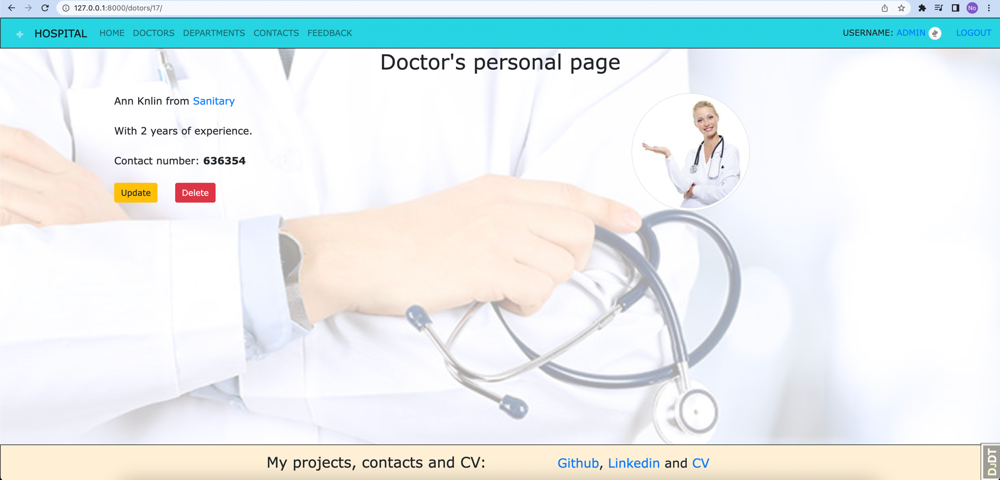

# Hospital

Django project for managing departments and doctors in hospital

## You can check it from this link

[Hospital project deploying to Render](https://hospital-8g7h.onrender.com/)

## Installation

Python3 must be already installed

```shell
git clone https://github.com/Evgeniy994/Hospital
cd Hospital
python3 -m venv venv
source venv/bin/activate
pip install -r requirements.txt
python manage.py runserver
```

## Features

* Authentication functionality for Doctors
* Managing departments and doctors from website interface
* Admin panel for advanced managing

## Demo


